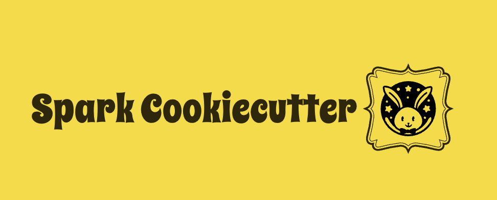

# Project JumpSpark - A spark-cookiecutter template with batteries included

Powered by [Cookiecutter](https://github.com/cookiecutter/cookiecutter), `JumpSpark (Spark-Cookiecutter)` is a framework for jumpstarting
production-ready PySpark projects quickly with sample spark codebase and testcases.

Get started today with `cookiecutter gh:Spratiher9/JumpSpark`

## Features

---

* Modern Project structure powered by [Poetry](https://python-poetry.org/)
* Pre-configured virtual environment with batteries included
* Supports the modern PySpark ecosystem
  1. [Quinn](https://github.com/MrPowers/quinn/) - Pyspark Helper functions to enhance developer productivity
  2. [Chispa](https://github.com/MrPowers/chispa) - PySpark test helper methods with beautiful error messages
  3. Many more updates coming ...
* Prepackaged sample codebase for quick starting

## Quickstart

---

Install the latest Cookiecutter if you haven't installed it yet (this requires
Cookiecutter 1.4.0 or higher)::

    pip install -U cookiecutter

Navigate to your project's directory location and generate with cookiecutter::
    
    cookiecutter gh:Spratiher9/JumpSpark

Enter the relevant details ( **_here `Angelou` is an example project_** )::

    project_name [new-project]: angelou
    package_name [angelou]: 
    project_version [0.1.0]: 
    full_name [Your Name]: Souvik Pratiher
    email [Your Email]: spratiher9@gmail.com
    github_username [github_username]: spratiher9
    project_description [This is a pyspark project]: PySpark on Poetry example
    python_version [3.9.6]: 
    line_length [88]: 

The following project structure will be generated in your project's directory location::

    angelou
    |-- angelou
    |   |--- __init__.py
    |   |--- sparksession.py
    |   |--- transformations.py
    |
    |-- mkdir
    |-- pyproject.toml
    |-- LICENSE
    |-- poetry.lock
    |-- README.md
    |-- tests
        |---  __init__.py
        |---  conftest.py
        |---  test_angelou.py
        |---  test_compare_dataframes.py
        |---  test_transformations.py

## What's next

In the coming days the cookiecutter template will be updated with:
* Support for more PySpark related packages
* Support for the CI-CD Devops Pipeline samples

If you got an idea to contribute to the project go for it.

    Fork the project
          |
          V
    Contribute your enhancements/features
          |
          V
    Raise PR to merge

Cheers!!
